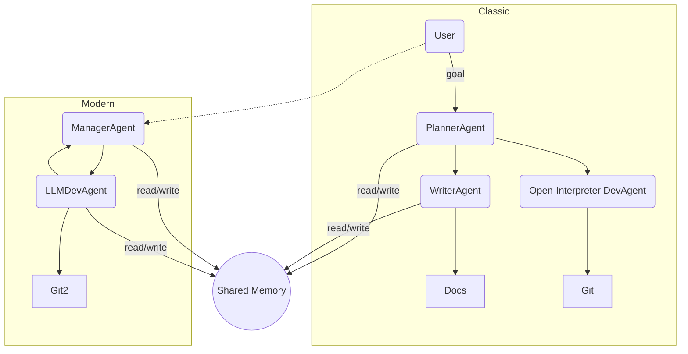

# Agent Network System (Build 1) (Experimental - Untested)

An **offline‑first agent network** that combines two complementary pipelines:

| Pipeline    | Entry‑point                   | Purpose                                                                                                                                                     |
| ----------- | ----------------------------- | ----------------------------------------------------------------------------------------------------------------------------------------------------------- |
| **Classic** | `python run.py "<goal>"`      | Planner → Writer → Open‑Interpreter DevAgent. Great for documentation‑heavy tasks that also need live code edits with sandboxed execution.                  |
| **Modern**  | `python run_loop.py "<goal>"` | ManagerAgent → LLMDevAgent. Demonstrates shared‐memory coordination and token‑aware trimming when you want pure LLM reasoning with optional code execution. |

> **One machine – one inference at a time.**  Both pipelines enforce sequential LLM calls so a single Ollama instance (CPU or GPU) is never double‑booked.

---

## 1  System Diagram



---

## 2  Hardware Requirements

| Component | Minimum                    | Recommended                                                                   |
| --------- | -------------------------- | ----------------------------------------------------------------------------- |
| **CPU**   | Any 4‑core x64             | 6+ cores for parallel build/test during code execution                        |
| **RAM**   | 8 GB                       | 16 GB+ (DeepSeek‑R1 7B quantised uses \~6 GB)                                 |
| **GPU**   | *(Optional)* Integrated    | NVIDIA RTX 30‑series or Intel ARC with ≥8 GB vRAM for faster Ollama inference |
| **Disk**  | 5 GB free (models)         | 15 GB+ if you pull multiple models (DeepSeek‑Coder, CodeLlama, etc.)          |
| **OS**    | Windows 10 64‑bit or later | Windows 11 22H2 with WSL 2 for Linux‑style tooling                            |

> *The system is equally happy on Linux/macOS, but the scripts assume a Windows host path for temporary files.*

---

## 3  Software Stack

* **Python ≥ 3.10**  (`python --version`)
* **Ollama ≥ 0.1.23** (local LLM server)
* **Git for Windows** ( command‑line `git` )
* **Visual Studio Build Tools** *(only if Open‑Interpreter needs C++ extensions)*
* **Python packages** – install via `pip install -r requirements.txt`

  * `open‑interpreter`, `duckduckgo‑search`, `beautifulsoup4`, `lxml`, `requests`, `pytest`, *optional* `tiktoken`, `ollama‑python`.

### 3.1  Pulling Models

```powershell
# DeepSeek‑R1 7B for reasoning / planning
ollama pull deepseek-r1:7b
# DeepSeek‑Coder for code‑centric DevAgent
ollama pull deepseek-coder
```

> Quantised (`q4_K_M`) models work fine; they reduce VRAM/RAM usage \~40%.

---

## 4  Setup

```powershell
python -m venv .venv
.\.venv\Scripts\Activate.ps1
pip install -r requirements.txt

# optional env‑vars ( PowerShell )
$env:OLLAMA_URL = "http://localhost:11434"
$env:DEV_MODEL   = "deepseek-coder"
$env:AGENT_MODEL = "deepseek-r1:7b"
```
Create an environment file (not provided in this repository) 
Template below. 

```
OLLAMA_API=http://localhost:11434/api/generate
# Models
PLANNER_MODEL=deepseek-r1:7b
WRITER_MODEL=deepseek-r1:7b
DEV_MODEL=deepseek-coder
TEST_COMMAND=pytest         

```

Create a fresh Git repo so snapshots work:

```powershell
git init
```

---

## 5  Usage

### 5.1  Documentation‑first (Classic) Pipeline

```powershell
python run.py "Document and implement a CLI to compute prime numbers"
```

**What happens**

1. Planner splits request into `[Doc]` and `[Code]` tasks.
2. Writer drafts Markdown docs; missing facts trigger DuckDuckGo research.
3. DevAgent (Open‑Interpreter) edits files and runs tests; commits via Git.

All docs land in `/docs/*.md`.  Commits are timestamped auto‑messages.

### 5.2  Manager + LLMDev Pipeline

```powershell
python run_loop.py "Build a simple calculator that adds two numbers"
```

1. ManagerAgent creates a plan (CoT inside `<think>` tags).
2. LLMDevAgent writes & executes code; result inserted back into memory.
3. Manager reviews and outputs a user‑friendly conclusion.

Run‐loop demonstrates **shared `Memory`** trimming to stay under 1500 tokens.

---

## 6  Testing

* **Unit tests**: place `*_test.py` or `test_*.py` files; they’re auto‑run by `pytest` inside the DevAgent fallback.
* **Manual**: inspect `.git` log to ensure only passing states are committed.
* **Timing**: each LLM call has a 300 s timeout; if a model is slow on first load, subsequent calls are cached in RAM.

---

## 7  Troubleshooting

| Symptom                                         | Fix                                                                       |
| ----------------------------------------------- | ------------------------------------------------------------------------- |
| `requests.exceptions.ConnectionError` to Ollama | Is Ollama running? `ollama serve`                                         |
| JSON key `'output'` missing                     | Upgrade Ollama ≥ 0.1.23 **or** edit `agents.py` fallback to `'response'`. |
| GPU OOM                                         | Use quantised model (`:q4_K_M`) or switch to CPU (`OLLAMA_NUM_GPU=0`).    |
| Endless context growth                          | `Memory.trim()` thresholds can be lowered (e.g. `max_tokens=1000`).       |
| DuckDuckGo blocked                              | Set `DDG_OFFLINE=1` and stub `search_tool.ddg_search`.                    |

---

## 8  Extending the System

* **Add more specialised agents** – e.g. a TesterAgent that only writes `pytest` suites, then let DevAgent implement fixes.
* **Vector store memory** – plug a lightweight Chroma DB; store full docs, keep only semantic summaries in prompt.
* **Async scheduler** – wrap Ollama calls in an `asyncio.Lock` to allow background I/O while respecting single‑GPU inference.
* **GUI** – build a simple Tk or Electron front‑end calling the same CLI scripts.

Pull requests welcome!  Enjoy your local multi‑agent workstation 🚀
